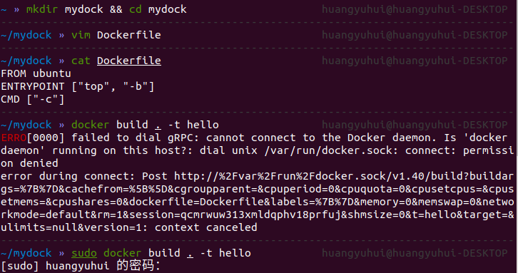
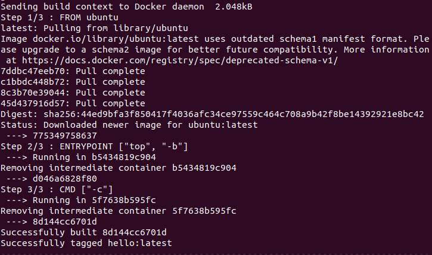
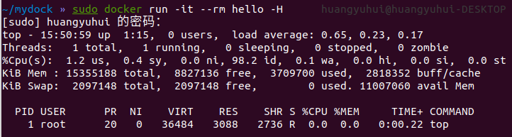
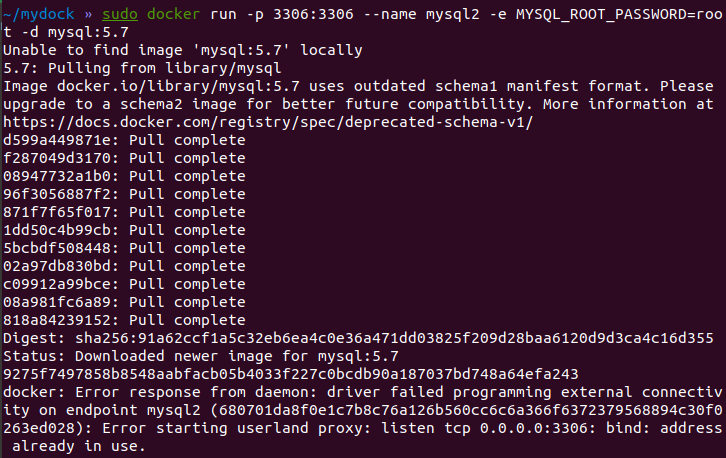
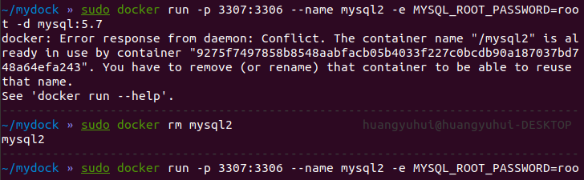
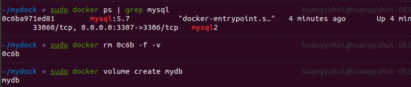
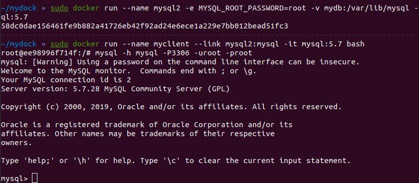
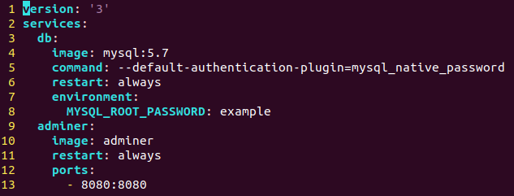
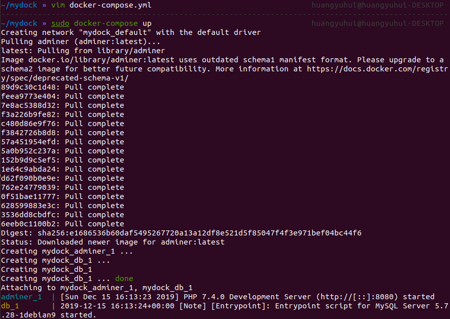
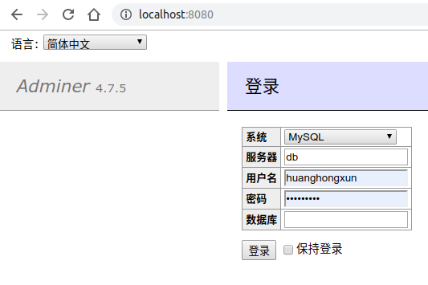

# 服务计算 - MySQL 与容器化

## 构建 Docker 镜像

构建 Docker 镜像需要 Dockerfile 文件，编辑的 Dockerfile 文件内容如下：

```Dockerfile
FROM ubuntu
ENTRYPOINT ["top", "-b"]
CMD ["-c"]
```

这个 Dockerfile 表示：镜像基于 `ubuntu:latest` 镜像，镜像启动后运行 `top -b -c` 命令。

其中，`ENTRYPOINT` 描述了容器的入口点，这个入口点程序是容器的初始进程（PID 1），因此在退出后容器就会退出，这就规定了容器的生命周期和 `top` 命令一致。

可以看到，`docker` 命令需要用户在 `docker` 用户组中，但是我的系统账号不在 `docker` 组中，因此必须使用 `sudo` 提权才可以执行 `docker` 命令。



第一次运行 docker run 时会下载 `ubuntu:latest` 镜像。



可以看到 `top` 命令的执行结果，用户为 `root`，表明容器内都是使用 `root` 用户执行程序的（虽然实际上由于用户命名空间，这个 `root` 非彼 `root`）



## 使用 MySQL 容器

为了使用 MySQL 容器，我们可以借助 `docker run` 命令直接运行 mysql 镜像，同样地，第一次运行时需要下载镜像。



由于我的电脑本来已经运行了 MySQL 数据库，因此占用了 3306 与 Docker 镜像冲突了，我需要先删除 `mysql2` 镜像后更换一个端口（这里采用了 3307 端口）



### 采用卷

为了将我们的容器更换为使用 docker 的卷以确保数据持久化。我们通过 `docker ps` 先找出旧镜像并删除，再创建卷。



重新创建后，启动另一个 mysql 容器，这两个容器的网络连接在一起，在 myclient 容器中，mysql 名称指向 mysql2 容器的 ip 地址，因此在 myclient 容器中可以使用 `mysql` 命令链接 mysql2 容器。



## Docker-compose

docker-compose 是一个很方便的多容器应用自动化部署工具。根据课件，配置文件如下



接着使用 `docker-compose up` 的方式运行我们编辑的 `docker-compose.yml`。



可以看到 adminer 已经启动

