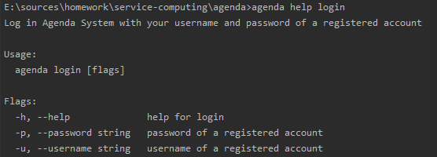
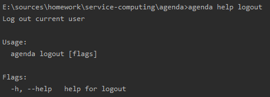
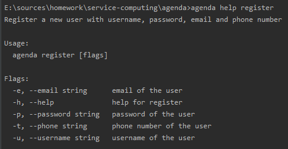
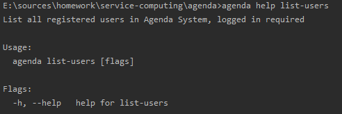
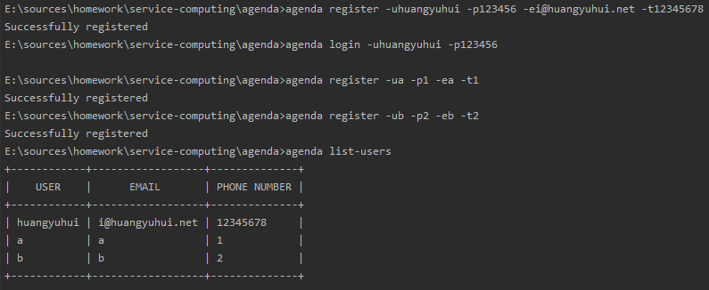
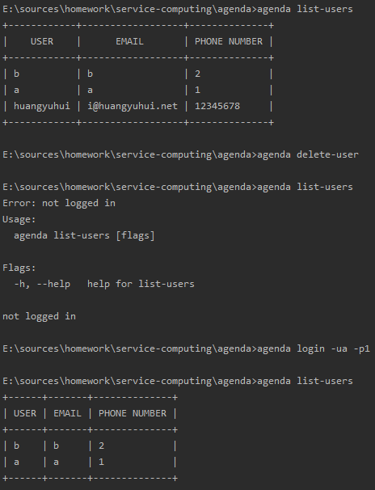

# 服务计算 - Agenda

本程序使用 `go modules` 管理源代码和依赖包。请确保你的 Go 环境为 1.13。

## 实验过程

### 创建项目

通过使用 `go mod init` 即可创建项目如下：

```bash
go mod init github.com/huanghongxun/agenda
```

### 编写代码

#### 参数处理

首先通过以下命令来创建 cobra 的预设代码

```bash
cobra init --pkg-name github.com/huanghongxun/agenda
```

然后创建 `cmd/user.go`，负责用户操作类命令：下面的代码为注册登录命令的代码

```go
var (
	loginCommand = cobra.Command{
		Use:   "login",
		Short: "Log in",
		Long:  "Log in Agenda System with your username and password of a registered account",
	}

	loginUsernameP = loginCommand.Flags().StringP("username", "u", "", "username of a registered account")
	loginPasswordP = loginCommand.Flags().StringP("password", "p", "", "password of a registered account")
)

loginCommand.RunE = func (cmd *cobra.Command, args []string) error {
    // ....
}
root.AddCommand(&loginCommand)
```

### 存储管理

我通过 `Storage` 结构体来管理用 `json` 格式保存的文件：

```go
type Storage struct {
	Path string
}

func (s *Storage) Load(v interface{}) error {
	file, err := os.Open(s.Path)
	if err != nil { return err }
	defer file.Close()
	return json.NewDecoder(file).Decode(v)
}

func (s *Storage) Save(v interface{}) error {
	file, err := os.Create(s.Path)
	if err != nil { return err }
	defer file.Close()
	return json.NewEncoder(file).Encode(v)
}
```

### 登录状态管理

利用 Storage 结构体，我们可以很方便地持久化登录状态

```go
type Session struct {
	LoggedIn bool `json:"logged_in"`
	Username string `json:"username"`
}

var sessionStorage = model.Storage{Path: "session.json"}
var session Session

func init() {
	err := sessionStorage.Load(&session)
	if os.IsNotExist(err) {
		session = Session{
			LoggedIn: false,
			Username: "",
		}
	} else if err != nil {
		if _, err := fmt.Fprintf(os.Stderr, "Unable to load session data from session.json"); err != nil {
			panic(err)
		}
		os.Exit(1)
	}
}

func GetCurrentUser() (username string, exists bool) {
	return session.Username, session.LoggedIn
}

func Login(username string) error {
	session.Username = username
	session.LoggedIn = true
	return sessionStorage.Save(session)
}

func Logout() error {
	session.Username = ""
	session.LoggedIn = false
	return sessionStorage.Save(session)
}
```

### 用户管理

用户管理无非就是增删改查，实际上我使用了数组来存储用户，因此只需要维护这个数组即可。

```go
type User struct {
	Username string `json:"username"`
	Password string `json:"password"`
	Email string `json:"email"`
	Phone string `json:"phone"`
}

var userStorage = model.Storage{Path: "users.json"}
var users []User

func init() {
	err := userStorage.Load(&users)
	if os.IsNotExist(err) {
		users = []User{}
	} else if err != nil {
		if _, err := fmt.Fprintf(os.Stderr, "Unable to load user data from users.json: %s", err.Error()); err != nil {
			panic(err)
		}
		os.Exit(1)
	}
}

func Save() error {
	return userStorage.Save(users)
}

func Add(user *User) (ok bool) {
	_, exists := FindByUsername(user.Username)
	if exists { return false }
	users = append(users, *user)
	return true
}

func DeleteByUsername(username string) error {
	for i, user := range users {
		if user.Username == username {
			// Remove ith item of users
			users[len(users)-1], users[i] = users[i], users[len(users)-1]
			users = users[:len(users)-1]
			return nil
		}
	}
	return errors.New("User " + username + " not found")
}

func FindByUsername(username string) (user *User, exists bool) {
	for _, user := range users {
		if user.Username == username {
			return &user, true
		}
	}
	return nil, false
}

func ListUsers() []User {
	return users
}
```

## 命令列表

### login



### logout



### register



### list-users



### delete-user


## 实验结果

### 注册登录功能



### 删除用户

删除用户首先列举了当前的用户列表，一共有 3 个用户，且已经以 `huangyuhui` 这个用户登录。

然后运行了 `delete-user` 命令删除用户，通过用户列表可知用户已被删除



### 数据存储

#### `session.json`

保存当前登录状态的文件

```json
{"logged_in":true,"username":"a"}
```

#### `users.json`

保存当前用户列表的文件

```
[{"username":"b","password":"2","email":"b","phone":"2"},{"username":"a","password":"1","email":"a","phone":"1"},{"username":"huangyuhui","password":"123456","email":"i@huangyuhui.net","phone":"12345678"}]
```