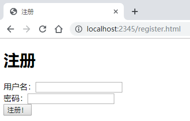
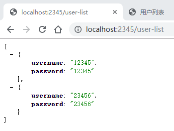
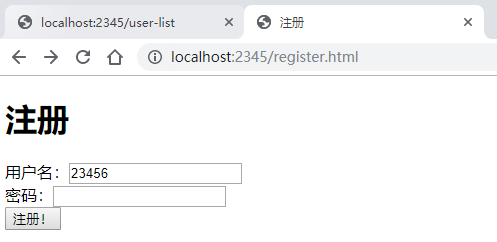
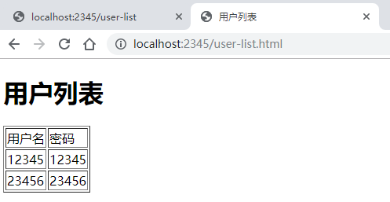
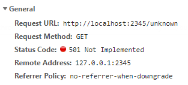

# cloudgo-io

## 实验结果

### 静态文件服务

可以看到服务成功提供了静态的 html 文件：

### 支持简单 js 访问

可以看到服务成功返回了一个 json（表示用户列表，浏览器自带插件已经格式化 JSON 内容）：

### 提交表单

提交表单页面如下：

注册成功后，会跳转到用户列表页，列表将出现新的用户：

### `/unknown`

可以看到，访问 `/unknown` 后服务器返回了 501。

### 支持 gbk 编码

